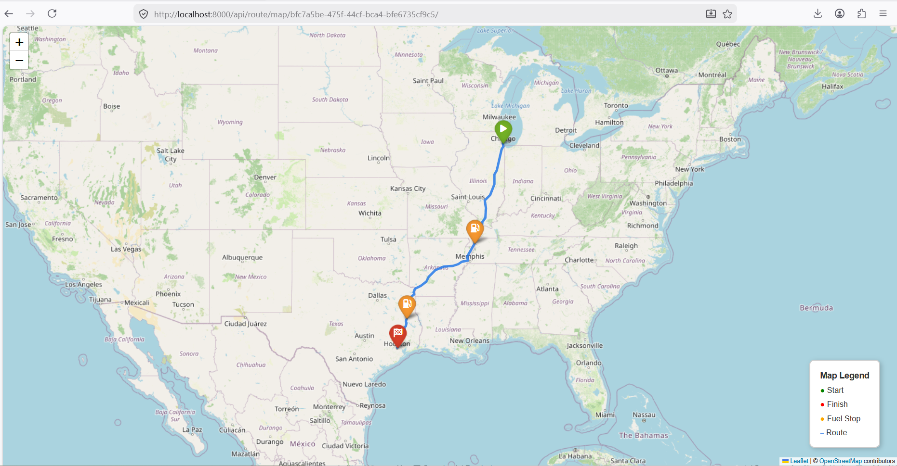
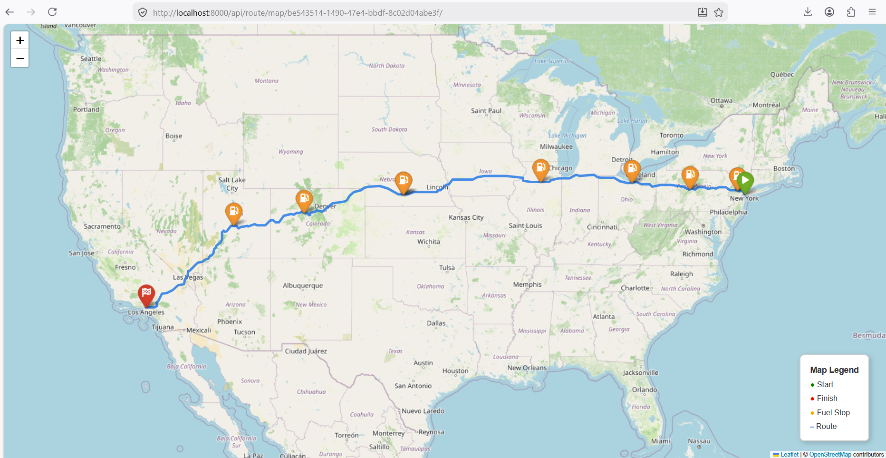

# Fuel Route Optimizer API

A Django REST API that calculates the most cost-effective fuel stops for a road trip across the continental USA. 

The API determines a driving route between a start and finish location, estimates fuel usage based on a standard 500-mile vehicle range and 10 MPG, and strategically places fuel stops in the cheapest available states along the route to minimize total fuel expenditure.

## Features

- **Geocoding & Routing**: Integrates with the [OpenRouteService (ORS) API](https://openrouteservice.org/) to convert human-readable addresses into coordinates and calculate drivable routes.
- **Smart Fuel Optimization**: Uses spatial data (`us_states.geojson`) and Shapely to determine which US states the route passes through. It evaluates fuel prices using a provided `fuel_prices.csv` to ensure stops are made in the cheapest possible states within the vehicle's remaining range.
- **Interactive Map Generation**: Generates an interactive Folium map (`HTML`) visualizing the route, state borders, and optimal fuel stops.




- **Stateless & High-Performance**: Operates completely in-memory (no database required). Heavy geometric lookups and state bounding boxes are pre-loaded at startup, and price queries are cached per request for ultra-fast performance.

## Prerequisites

- **Python 3.10+**
- **OpenRouteService API Key**: Get a free API key at [OpenRouteService](https://openrouteservice.org/dev/#/signup).
- **Fuel Prices Data**: A file named `fuel_prices.csv` containing truck stop and fuel price data. It must be placed in the root directory.

## Installation & Setup

1. **Clone the repository** (or download the source):
   ```bash
   git clone https://github.com/shaikhaman284/fuel_route_restapi.git
   cd fuel_route_restapi
   ```

2. **Create and activate a virtual environment**:
   ```bash
   python -m venv venv
   # Windows:
   venv\Scripts\activate
   # macOS/Linux:
   source venv/bin/activate
   ```

3. **Install dependencies**:
   ```bash
   pip install -r requirements.txt
   ```

4. **Environment Variables Configuration**:
   Rename the provided `.env.example` file to `.env` (or create a new `.env` file) and add your OpenRouteService API key:
   ```env
   ORS_API_KEY=your_actual_api_key_here
   ```

5. **Provide Data Files**:
   Ensure `fuel_prices.csv` is present in the root directory. (The required `us_states.geojson` file will be automatically downloaded by the app if it is missing).

6. **Run the Server**:
   ```bash
   python manage.py runserver
   ```

## API Documentation

### 1. Health Check
Checks if the API is running and if the `fuel_prices.csv` is correctly loaded.

- **URL:** `/api/health/`
- **Method:** `GET`
- **Success Response:**
  ```json
  {
      "status": "ok",
      "message": "Fuel Route API is running",
      "fuel_prices_csv": "loaded"
  }
  ```

### 2. Calculate Optimal Route
Calculates the driving route and optimal fuel stops based on retail fuel prices.

- **URL:** `/api/route/`
- **Method:** `POST`
- **Headers:** `Content-Type: application/json`
- **Body:**
  ```json
  {
      "start": "Los Angeles, CA",
      "finish": "San Diego, CA"
  }
  ```
- **Success Response:**
  ```json
  {
      "start": "Los Angeles, CA, USA",
      "finish": "San Diego, CA, USA",
      "total_distance_miles": 123.04,
      "total_gallons_needed": 12.3,
      "total_fuel_cost_usd": 0.0,
      "fuel_stops": [],
      "map_url": "/api/route/map/<uuid>/",
      "optimization_note": "Fuel stops selected to minimize cost..."
  }
  ```
  *(Note: `fuel_stops` will populate with a list of stop details for longer trips exceeding 500 miles).*

### 3. View Interactive Route Map
Retrieves the standalone HTML map generated by the `POST /api/route/` endpoint.

- **URL:** `/api/route/map/<route_id>/`
- **Method:** `GET`
- **Response:** Returns an interactive `text/html` Folium map document.

## Project Structure

```text
├── .env                    # Environment variables (API keys)
├── .gitignore              # Git ignore configurations
├── fuel_prices.csv         # Retail fuel pricing data (Required)
├── manage.py               # Django management script
├── requirements.txt        # Python dependencies
├── route/                  # Main Django app
│   ├── utils/              # Core logic modules
│   │   ├── fuel_optimizer.py  # Greedy fuel stop calculation
│   │   ├── geocoder.py        # ORS geocoding integration
│   │   ├── map_generator.py   # Folium interactive map generation
│   │   ├── router.py          # ORS driving route calculation
│   │   └── state_detector.py  # Spatial geometry and state lookups
│   ├── urls.py             # API endpoint routing
│   └── views.py            # API View controllers
└── us_states.geojson       # Local cache of US state geometry (Auto-downloaded)
```

## Technical Decisions

- **Why no database?** The application doesn't need to persist user state. Keeping it stateless ensures horizontal scalability. Maps are temporarily stored in-memory per server process since they are just HTML strings.
- **Why OpenRouteService?** It offers an excellent, open-source alternative to Google Maps API for geocoding and routing directions, providing detailed GeoJSON route paths necessary for geometric analysis.
- **Why Shapely?** Shapely provides fast and accurate geometric point-in-polygon checks to pinpoint exactly which state a geographical coordinate belongs to.
